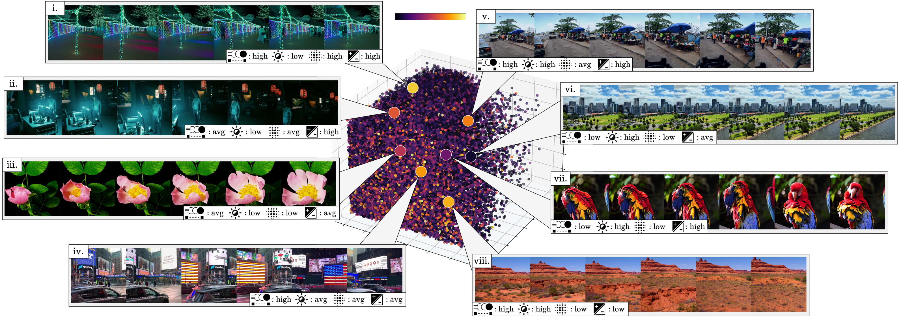

# LAVIB


<p align="center">

<br>
<p align="center">
Code and scripts for "LAVIB: Large-scale Video Interpolation Benchmark" <br>
To appear in <a href="https://neurips.cc/Conferences/2024"> the 38th Annual Conference on Neural Information Processing Systems (NeurIPS) 2024</a><br>
<a href="https://alexandrosstergiou.github.io/datasets/LAVIB" target="_blank">[project website 🌐]</a>
&nbsp;&nbsp;&nbsp;
<a href="https://arxiv.org/abs/2406.09754" target=”_blank” >[arXiv preprint 📃]</a>
&nbsp;&nbsp;&nbsp;
<a href="https://huggingface.co/datasets/astergiou/LAVIB/tree/main" target=”_blank” >[dataset 🤗]</a>
&nbsp;&nbsp;&nbsp;
</p>
</p>


## Table of contents

1. [Download](#download)
   - [Introduction](#introduction)
   - [Annotations](#annotations)
   - [Script](#script)
2. [VFI benchmark](#vfi-benchmark)
   - [Dependencies](#dependencies)
   - [Running RIFE](#running-rife)
   - [Running EMA-VFI](#running-ema-vfi)
   - [Running FLAVR](#running-flavr)
   - [Model weights](#weights)
3. [Additional info](#additional-info)
   - [Citation](#citation)
   - [License](#license)


# Download
The dataset and splits are hosted on [huggingface](https://huggingface.co/datasets/astergiou/LAVIB/tree/main)

## Introduction

The dataset is stored in multiple chuncks of 20GB (lavib00, lavib01,etc.). This is done to avoid network overheads and allow and improve download speeds over multiple threads. After downloading files will need to then be combined before being extracted.

## Annotations

- `name` is the unique video index from which the clip is obtained.

- `shot` is the index of the extracted 10-second segment from the video.

- `tmp_crop` is the index (1-10) of the 1-second temporal location of the clip.

- `vrt_crop` is the spatial location (1-2) that the tubelet is exctracted from. It corresponds to the Y axis.

- `hrz_crop` is the spatial location (1-2) that the tubelet is exctracted from. It corresponds to the X axis.


The folders containing videos can be referenced by: `<name>_hot<shot>_<tmp_crop>_<vrt_crop>_<hrz_crop>/vid.mp4`


> The main benchmark splits are `train.csv`, `val.csv`, and `test.csv` .

> OOD splits can be loaded frfom their respective `.csvs`:

__OOD-AFM__
- `train_high_fm.csv`, `val_high_fm.csv`, and `test_high_fm.csv`

- `train_low_fm.csv`, `val_low_fm.csv`, and `test_low_fm.csv`

__OOD-ALV__
- `train_high_lv.csv`, `val_high_lv.csv`, and `test_high_lv.csv`

- `train_low_lv.csv`, `val_low_lv.csv`, and `test_low_lv.csv`


__OOD-ARMS__
+ `train_high_rc.csv`, `val_high_rc.csv`, and `test_high_rc.csv`

+ `train_low_rc.csv`, `val_low_rc.csv`, and `test_low_rc.csv`


__OOD-APL__
- `train_high_pl.csv`, `val_high_pl.csv`, and `test_high_pl.csv`

- `train_low_pl.csv`, `val_low_pl.csv`, and `test_low_pl.csv`


## Script

You can also automatically download data and splits with `lavib_downloader.sh`.

You can resize video frames during data loading. Howevewer this includes significant overheads in loading/processing times. As an alternative you can store the videos at reduced resolutions and load them directly. To do this you can use `resize.py` with resizes videos to 540x540.


# VFI benchmark

Three codebases are adjusted for VFI general instructions are given below


## Dependencies

The required packages are listed below

- `torch >= 1.13.0`
- `torchvision >= 0.14.0`
- `numpy >= 1.22.4`
- `pandas >= 1.3.4`
- `sk-video >= 1.1.10`
- `tqdm >= 4.65.0`
- `wget >= 3.3`
- `timm >= 1.0.3`
- `pytorchvideo` -> `pip install git+https://github.com/facebookresearch/pytorchvideo.git@1fadaef40dd393ca09680f55582399f4679fc9b7`
- `pytorch_msssim >= 1.0.0`


## Running RIFE

Please see the original repo for more details [RIFE repo link](https://github.com/hzwer/ECCV2022-RIFE).
To run either training or inference use `VFI/RIDE/train.py`

The following call arguments are added:
- `root_dir`: The folder location that `segments_downsampled` are stored in. If you are using the original sizes of videos you can adjust `VFI/RIFE/dataset.py` to load directly the `segments`.
- `eval_only`: Integer (0-1) for running only inference. If set to 1 then only inference will run.
- `set`: Definition for the challenge to run see `choices` for the available options.

Example run for training:
```
python train.py --batch_size 4 --root_dir /media/SCRATCH/LAVIB 
```

Example run for inference (only) in `high_afm`:
```
python train.py --batch_size 1 --root_dir /media/SCRATCH/LAVIB --eval_only 1 --set high_fm --pretrained ckpt.pth
```


## Running EMA-VFI

Please see the original repo for more details [EMA-VFI repo link](https://github.com/MCG-NJU/EMA-VFI).
For train or inference use `VFI/EMA-VFI/train.py`.

The following call arguments are added:
- `data_path`: The folder location that `segments_downsampled` are stored in. If you are using the original sizes of videos you can adjust `VFI/RIFE/dataset.py` to load directly the `segments`.
- `eval_only`: Integer (0-1) for running only inference. If set to 1 then only inference will run.
- `set`: Definition for the challenge to run see `choices` for the available options.

Example run for training:
```
python train.py --batch_size 4 --data_path /media/SCRATCH/LAVIB 
```

Example run for inference (only) in `high_afm`:
```
python train.py --batch_size 1 --data_path /media/SCRATCH/LAVIB --eval_only 1 --set high_fm --pretrained ckpt.pth
```


## Running FLAVR

Please see the original repo for more details [FLAVR repo link](https://github.com/tarun005/FLAVR).
For train or inference use `VFI/FLAVR/main.py`.

The following call arguments are added:
- `data_root`: The folder location that `segments_downsampled` are stored in. If you are using the original sizes of videos you can adjust `VFI/RIFE/dataset.py` to load directly the `segments`.
- `eval_only`: Integer (0-1) for running only inference. If set to 1 then only inference will run.
- `set`: Definition for the challenge to run see `choices` for the available options.

Example run for training:
```
python main.py --batch_size 4 --data_root /media/SCRATCH/LAVIB 
```

Example run for inference (only) in `high_afm`:
```
python main.py --batch_size 1 --data_path /media/SCRATCH/LAVIB --eval_only 1 --set high_fm --pretrained ckpt.pth
```

## Weights

Main benchmark weights can be found [here](https://www.dropbox.com/scl/fo/52ydzab9k0zpkn2cd1thl/ADF2VfSsZn8wWOcXgX9gv9M?rlkey=xt7xaqo24n1yjgtrcl3m3agc1&st=3bteqr74&dl=0)

OOD challenges weights can be found [here](https://www.dropbox.com/scl/fo/kug85bpnm6dxasz8p7z28/AN_aObMeFoTSgl8QPzSX_9c?rlkey=gz43sxpumx20tcb2ytzoudyo1&st=nv4qgbbn&dl=0)

# Additional Info


## Citation

```bibtex
@inproceedings{stergiou2024lavib,
      title={LAVIB: Large-scale Video Interpolation Benchmark},
      author={Stergiou, Alexandros},
      booktitle={NeurIPS},
      year={2024}
    }
```


## License

CC BY-SA-NC 4.0

